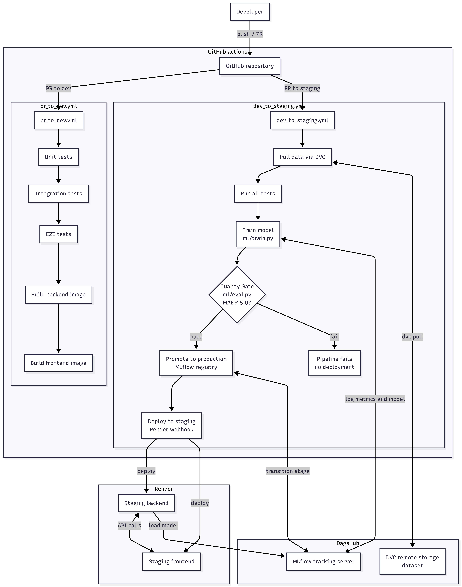

<h1 align="center">MLOps Final Project</h1>
<h3 align="center">Predicting Toyota stock prices</h3>
<p align="center">
    
    
    
</p>


# Dataset

For this project we will be using the Toyota Stock Prices: [1980-2026 Historical Data dataset](https://www.kaggle.com/datasets/omarshahrukh/toyota-stock-prices-1980-2026-historical-data?resource=download) from Kaggle. This dataset contains historical stock price data for Toyota from 1980 to 2026, including open, high, low, close prices, and trading volume.

With this dataset we aims to predict the closing price of Toyota stock based on the features open, high, low, `volume` using a machine learning model. We will train a Random Forest Regressor and evaluate its performance using Mean Squared Error (MSE) and Mean Absolute Error (MAE) metrics.

# Architecture Diagram



# CI/CD Explanation

## Pull request to `dev` branch pipeline

When a pull request is opened targeting the `dev` branch, a GitHub Actions workflow (`pr_to_dev.yml`) is automatically triggered. This pipeline ensures code quality and integration before any merge is allowed.

### Pipeline Steps

1. **Checkout code** : retrieves the latest code from the repository.
2. **Set up Python 3.10** : installs the required Python version.
3. **Install dependencies** : installs all backend dependencies from `backend/requirements.txt`.
4. **Run unit tests** : executes unit tests located in `tests/test_unit.py`
5. **Run integration tests** : executes integration tests in `tests/test_integration.py`
6. **Run End-to-End Tests** : executes end-to-end tests in `tests/test_e2e.py`
7. **Build backend docker image** : builds the backend Docker image from `./backend`
8. **Build frontend docker image** : builds the frontend Docker image from `./frontend`

> All steps must pass for the pull request to be eligible for merging into `dev`.

## Pull Request to `staging` Branch Pipeline

When a pull request is opened targeting the `staging` branch a GitHub Actions workflow (`dev_to_staging.yml`) is automatically triggered. This pipeline handles training, quality validation, and automatic deployment to the staging environment.

### Environment Variables

The pipeline uses the following secrets and environment variables:
- **`MLFLOW_TRACKING_URI`** : URI of the MLflow tracking server hosted on DagsHub.
- **`DAGSHUB_USERNAME` / `DAGSHUB_TOKEN`** : Credentials for DagsHub (used for both MLflow and DVC).
- **`MAE_THRESHOLD`** : Maximum acceptable MAE value (`5.0`) used as a quality gate for model promotion.

### Pipeline Steps

1. **Checkout code**: retrieves the latest code from the repository.
2. **Set up python 3.10**: installs the required Python version.
3. **Install dependencies**: installs all backend dependencies plus additional packages (`pytest`, `dvc`, `mlflow`, etc.).
4. **Debug DVC config**: prints DVC version, configured remotes, and `.dvc/config` content for troubleshooting.
5. **Pull tracked data (DVC)**: authenticates with DagsHub and pulls the tracked dataset using DVC. Fails early if the `origin` remote is not configured.
6. **Run all tests**: executes the full test suite (`tests/`) to ensure nothing is broken before training.
7. **Train and register candidate model**: runs `ml/train.py` to train a new model and logs it to MLflow. Outputs results to `train_output.json`.
8. **Run automated quality gates**: evaluates the trained model metrics from `train_output.json` using `ml/eval.py`. The model is only promoted if its **MAE is below the defined threshold (`5.0`)**.
9. **Deploy to staging**: if all previous steps pass, triggers a deployment to the staging environment on Render via a webhook.

#Model promotion is handled automatically during the `dev_to_staging.yml` pipeline. It follows a two-step process: **training & registration** and **quality gate evaluation**.

# Model Promotion Process

## 1. Training and registration (`ml/train.py`)

Every time the pipeline runs a new candidate model is trained and logged to **MLflow** (hosted on DagsHub) with the following information:

- **Metrics**: `MSE`, `MAE`, `R2`
- **Parameters**: model type (`RandomForestRegressor`), `n_estimators`, `max_depth`
- **Versions**: git commit hash (`GIT_COMMIT`) and DVC dataset version (`DATA_VERSION`)

The model is then **registered** in the MLflow model registry under the name `ToyotaStockPredictor` and the results are saved to `train_output.json` for the next step.

## 2. Quality gate (`ml/eval.py`)

After training, `eval.py` reads `train_output.json` and checks whether the model meets the quality threshold:

| metric | threshold | Condition |
|--------|-----------|-----------|
| MAE    | `5.0`     | must be ≤ threshold |

- **If MAE ≤ 5.0** : the model version is automatically **transitioned to the `Production` stage** in the MLflow Model Registry.
- **If MAE > 5.0** : the pipeline **fails**, the model is **not promoted**, and the deployment to staging is **blocked**.


# Reproducibility Instructions


## Prerequisites

- Python 3.10
- Docker
- Git
- A [DagsHub](https://dagshub.com) account
- A [Kaggle](https://www.kaggle.com) account (to download the dataset)

## 1. Clone the repository

```bash
git clone https://github.com/Skrinox/MLOps-final-project.git
cd MLOps-final-project
```
## 2. Setup DVC

- Install pipx: `python3 -m pip install --user pipx`
- Install DVC: `pipx install dvc`
- Initialize DVC in the project: `dvc init` in the root directory of the project
This will create a .dvc and .dvcignore file in the project.
- Add the dataset to DVC: `dvc add data/toyota_stock_prices.csv`
This will create a .dvc file for the dataset and add it to the DVC tracking.
- we can commit the files to git.

To **store our data remotly** we use **Dagshub**. After creating a new repository on DagsHub (connected to our Github repo) we add the DVC remote and setup our credentials:
```Bash
dvc remote add origin https://dagshub.com/Skrinox/MLOps-final-project.dvc

dvc remote modify origin --local auth basic
dvc remote modify origin --local user <dagshub_username>
dvc remote modify origin --local password <dagshub_token>
```
Then we can push our data to the remote: `dvc push -r origin` and commit the changes to git.

## 4. Setup MLflow

Set the following environment variables to connect to the MLflow tracking server on DagsHub:
```bash
MLFLOW_TRACKING_URI=<your_mlflow_tracking_uri>
MLFLOW_TRACKING_USERNAME=<dagshub_username>
MLFLOW_TRACKING_PASSWORD=<dagshub_token>
```

## 5. Train the model

```bash
python ml/train.py
```
This will train a `RandomForestRegressor` on the Toyota stock dataset, log metrics and parameters to MLflow, and save results to `train_output.json`.

## 6. Run the quality gate

```bash
cat train_output.json | python ml/eval.py
```
If the MAE is below `5.0` the model will be automatically promoted to **production** in the MLflow model registry.

## 7. Run tests

```bash
python -m pytest tests/ -v
```

## 8. Run with docker

```bash
docker build -t toyota-backend ./backend
docker build -t toyota-frontend ./frontend
docker run -p 8000:8000 toyota-backend
docker run -p 3000:3000 toyota-frontend
```
Alternatively you can use `docker-compose` to run both services together:
```bash
docker-compose up --build
```


